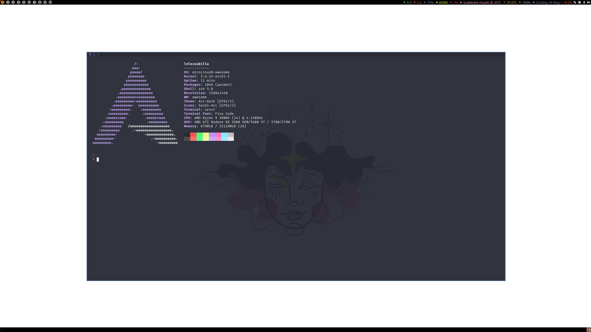

<p align="center">
  <a target="_blank" rel="noopener noreferrer">
    
  </a>
</p>

<p align="center">
  <a href="https://opensource.org/licenses/ISC">
    
  </a>
  <a href="https://gitter.im/lcbm/community">
    
  </a>
</p>

<p align="center">
  <a target="_blank" rel="noopener noreferrer">
    
  </a>
</p>

## 🎨 Theming

- Window Manager: [Awesome WM](https://awesomewm.org)
- Terminal Emulator: [URxvt](http://software.schmorp.de/pkg/rxvt-unicode.html)
- Prompt: [Pure](https://github.com/sindresorhus/pure)
- Theme: [Dracula](https://draculatheme.com)
- Font: [Fira Code](https://github.com/tonsky/FiraCode)
- Wallpaper: [Girls](https://www.behance.net/gallery/95855077/Girls-Paint-and-Digital-Illustration) by [@soaresdelapaula](https://www.behance.net/soaresdelapaula)

## 🚀 Installation

### Prerequisites

- `git`: to clone the repo
- `zsh` or `bash`: to actually run the dotfiles
- `sudo`: some configs may need that

### Getting Started

```bash
$ git clone https://github.com/lcbm/dotfiles.git ~/.dotfiles
$ cd ~/.dotfiles
$ ./scripts/bootstrap
$ zsh # or just close and open your terminal again.
```

> **note**: this script is still a work in progress, for this reason it still does not copy over the files to the $HOME directory -- you should do this manually.

## 🤝 Contributing

We are always looking for contributors of **all skill levels**! If you're looking to ease your way into the project, try out a [good first issue](https://github.com/lcbm/dotfiles/labels/good%20first%20issue).

If you are interested in helping contribute to the project, please take a look at our [Contributing Guide](CONTRIBUTING.md). Also, feel free to drop in our [community chat](https://gitter.im/lcbm/community) and say hi. 👋

Also, thank you to all the [people who already contributed](https://github.com/lcbm/dotfiles/graphs/contributors) to the project!

## 💭 Inspired By

Please check out these previous works that helped inspire us. 🙏

- **[caarlos0/dotfiles](https://github.com/caarlos0/dotfiles)** - Config files for ZSH, Java, Ruby, Go, Editors, Terminals and more.

- **[mathiasbynens/dotfiles](https://github.com/mathiasbynens/dotfiles)** - .files, including ~/.macos — sensible hacker defaults for macOS .

- **[dotfiles/dotfiles.github.com](https://github.com/dotfiles/dotfiles.github.com)** - Your unofficial guide to dotfiles on GitHub.

- **[cli/cli](https://github.com/cli/cli)** - GitHub’s official command line tool.

## 💡 Feedback

This project is currently early in its development, and we're hoping to get feedback from people using it, or whom have used other similar projects and have suggestions!

We'd love for you to take a short survey here (no more than five minutes): https://forms.gle/iXE9UEoCgZFvJa3R6

Finally, if you spot bugs or have features that you'd really like to see in here, please take a look at our [Contributing Guide](CONTRIBUTING.md).

## 📝 License

Copyright © 2020-present, [Dotfiles Contributors](https://github.com/lcbm/dotfiles/graphs/contributors).
This project is [ISC](LICENSE) licensed.
